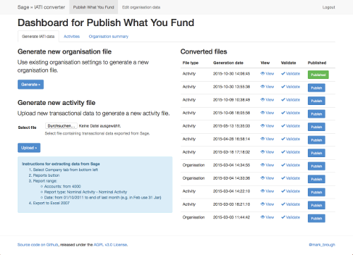

# Sage to IATI Publisher

Converts transactional information exported from Sage accounting software into IATI-XML format.

Works with: 

* Sage 50 Accounts Plus 2011 (version 17.0.15.208)

## How does it work?

1. Set up your activities (i.e. projects) in the user interface or in the setup file (see below)
2. Upload a spreadsheet of transactional data exported from Sage (instructions for specific data you need to export are in the user interface)
3. The "Department" field in your Sage data is used to map to the activity code that you set in the user interface
4. You can also specify accounts to aggregate (e.g. salaries) and strings that should be redacted from your transaction descriptions (e.g. people's names or initials)
5. You can then preview and generate IATI-XML data
6. When you're ready, you can then publish your IATI-XML data so that you can register it with the IATI Registry.

#### Dashboard

Published files (where you click the blue `Publish` button next to a file and it turns green) are available at `organisation.xml` or `activity.xml`. At the moment, you can only have one of each type of file published.

For example, if you're looking at the Dashboard at:
http://sage2iati.publishwhatyoufund.org/publish-what-you-fund/

Then the activity file will be available at:
http://sage2iati.publishwhatyoufund.org/publish-what-you-fund/activity.xml

If you get a `404 - File Not Found` error, make sure you've published a file.

#### Import transactions

Once you've uploaded a file, you can see how the transactions have been attached to your activities, and can see how the transactions have been aggregated (if relevant) or if the transaction descriptions have been partially redacted (if you specified strings to redact in your organisation settings).

#### Edit organisation data

By clicking on "Edit organisation data" from the top menu bar, you can edit:
* basic information (e.g. organisation code, organisation currency)
* annual budgets for the organisation
* documents (e.g. annual report, audit)
* funding organisations (which will appear alongside each of your activities)
* privacy settings (accounts to aggregate and strings to redact, e.g. personally-identifiable information from your transaction descriptions)

## License: AGPL v3.0

Copyright (C) 2015 Mark Brough, Publish What You Fund

    This program is free software: you can redistribute it and/or modify
    it under the terms of the GNU Affero General Public License as
    published by the Free Software Foundation, either version 3 of the
    License, or (at your option) any later version.

    This program is distributed in the hope that it will be useful,
    but WITHOUT ANY WARRANTY; without even the implied warranty of
    MERCHANTABILITY or FITNESS FOR A PARTICULAR PURPOSE.  See the
    GNU Affero General Public License for more details.

    You should have received a copy of the GNU Affero General Public License
    along with this program.  If not, see <http://www.gnu.org/licenses/>.
    
#### DISCLAIMER

    This software is not in any way endorsed by or related to Sage.
    
## Installation

Set up a virtualenv:

    virtualenv ./pyenv

Activate the virtualenv:

    source ./pyenv/bin/activate

Install the requirements:

    pip install -r requirements.txt

Copy and edit the config.py.tmpl:

    cp config.py.tmpl config.py

You can also copy end edit the setup.py.tmpl to get going quickly (this 
will be replaced with a more sensible setup mechanism in future):

    cp sageiaticreator/setup.py.tmpl setup.py

Run the server:

    python manage.py runserver

Setup:

    http://localhost:5000/setup/
